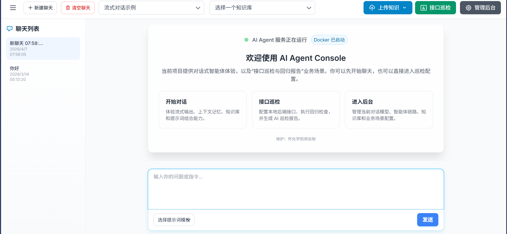
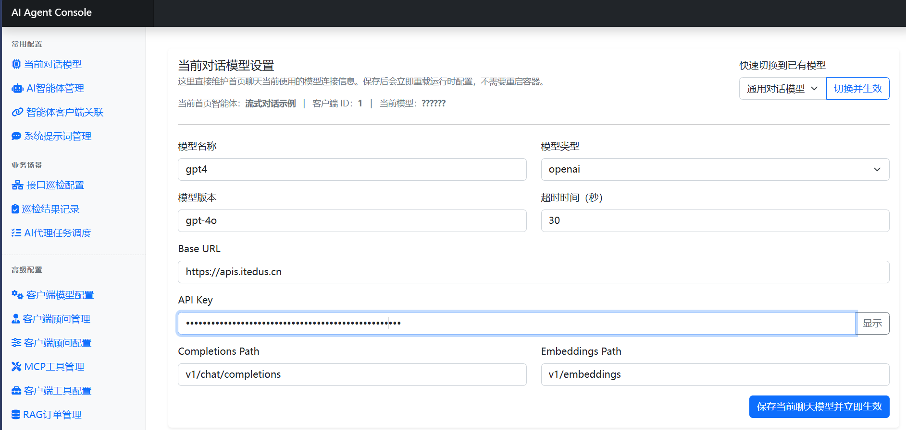
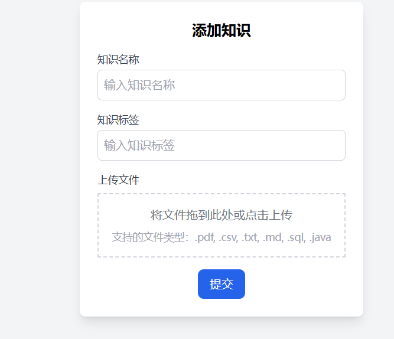
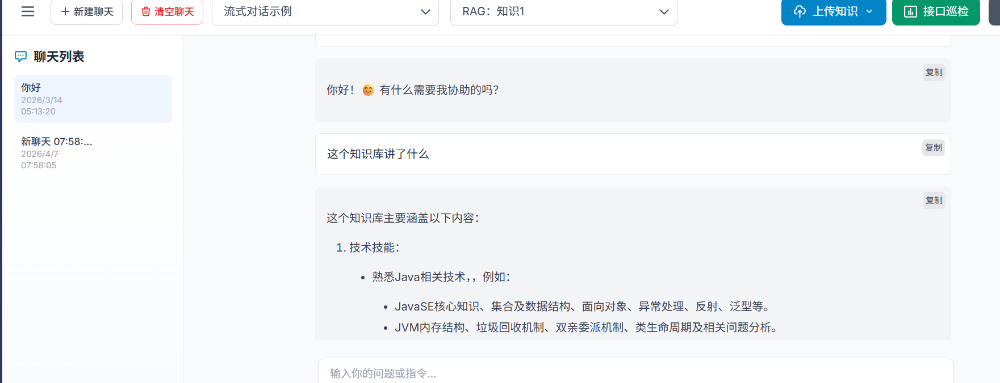
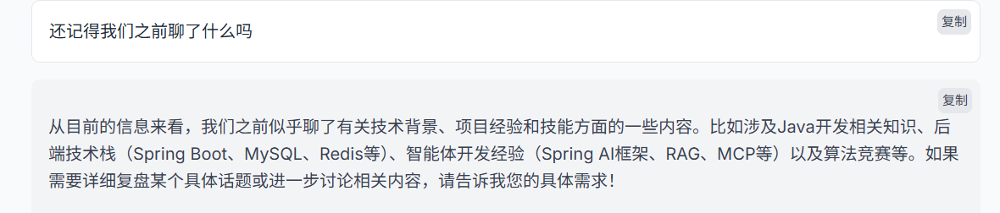
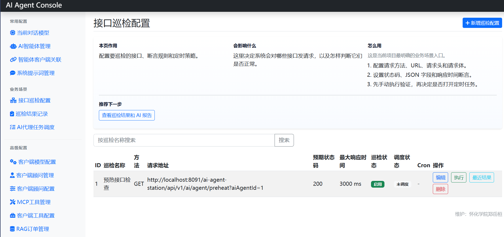
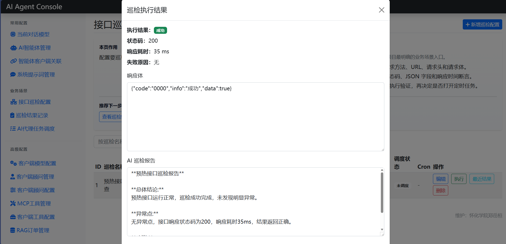

# AI Agent Console

一个基于 Spring AI 的 AI Agent 综合应用项目。项目把模型、系统提示词、知识库、MCP 工具、任务调度和接口巡检能力放到后台统一配置，并在启动时装配成可运行的对话模型与智能体客户端。

当前版本主要包含两条主线：

- 对话式智能体：支持流式对话、上下文连续性、知识库问答和模型在线切换。
- 接口巡检与回归报告：支持配置本地后端接口、执行 HTTP 请求、做断言校验，并生成 AI 巡检报告。

这个项目的目标不是只做一个聊天页面，而是把 AI 对话、知识库检索、工具调用和业务场景配置放在同一个后台里，方便演示和扩展。

## 功能预览

### 首页与对话入口

首页提供对话、知识库、接口巡检和后台管理入口。对话窗口支持流式输出和同窗口上下文连续性。



### 模型在线配置

后台可以直接维护当前对话模型，包括 `Base URL`、`API Key`、模型版本、接口路径和超时时间。修改后会重新加载运行时配置，不需要重启容器。



### 知识库上传

支持上传 `.pdf`、`.csv`、`.txt`、`.md`、`.sql`、`.java` 等文件。文件会被解析、切分、向量化后写入 pgvector，用于后续 RAG 检索。



### 知识库问答

对话时可以选择指定知识库，系统会按知识库标签做相似度检索，并把检索结果注入 Prompt，提高长文档问答效果。



### 上下文连续对话

同一个聊天窗口内会带入最近几轮上下文，适合做连续追问和多轮解释。



### 后台配置中心

后台按常用配置、业务场景和高级配置组织菜单，可以管理模型、智能体、系统提示词、MCP 工具、RAG 订单和任务调度。



### 接口巡检与回归报告

可以配置要巡检的接口、请求方法、URL、请求头、请求体、响应时间阈值和断言规则。执行后会记录状态码、耗时、响应体和 AI 巡检报告。



## 核心能力

- 配置驱动装配：模型、提示词、Advisor、MCP 工具和执行顺序都可以拆成数据库配置，启动预热阶段装配为 `ChatModel` 与 `ChatClient`。
- RAG 知识库问答：使用 Apache Tika 解析文档，结合文本分块、Embedding 和 PostgreSQL(pgvector) 完成向量检索。
- MCP 工具扩展：支持通过 `sse` 和 `stdio` 两种方式加载外部工具服务，让智能体具备调用外部系统的能力。
- 流式对话体验：后端基于 SSE 输出，前端增量渲染回答内容，并保留当前窗口的上下文。
- 接口巡检场景：支持配置接口、执行 HTTP 请求、按状态码、JSON 字段和响应时间进行校验，并生成巡检报告。
- Docker 一键部署：通过 Docker Compose 启动 MySQL、PostgreSQL(pgvector)、后端服务和前端页面。

## 技术栈

- Java 17
- Spring Boot
- Spring AI
- MyBatis
- MySQL
- PostgreSQL + pgvector
- MCP
- Docker Compose
- Nginx

## 项目结构

```text
ai-agent-station-api              接口定义和通用响应结构
ai-agent-station-app              Spring Boot 启动模块和基础配置
ai-agent-station-domain           核心领域服务，包含 Agent 装配、对话、RAG 等逻辑
ai-agent-station-infrastructure   DAO、仓储和持久化实现
ai-agent-station-trigger          HTTP 接口、后台控制器和任务调度入口
ai-agent-station-types            公共类型、常量和异常定义
docs/dev-ops-v2                   SQL、前端静态页面和部署资源
deploy/one-click                  Docker Compose 一键部署方案
image                             项目功能截图
```

## 快速部署

推荐使用 `deploy/one-click` 目录中的 Docker Compose 方案启动项目。

### 1. 准备环境

需要先安装：

- Docker Desktop
- Git
- 可用的 OpenAI-compatible 模型服务

模型服务至少需要支持：

- `/v1/chat/completions`
- `/v1/embeddings`

如果只验证普通对话，聊天接口可用即可。如果要验证知识库上传和 RAG，需要 embedding 接口也可用。

### 2. 进入部署目录

```powershell
cd deploy\one-click
```

### 3. 创建环境变量文件

```powershell
Copy-Item .env.example .env
```

Linux / macOS：

```sh
cp .env.example .env
```

### 4. 修改 `.env`

至少需要配置以下内容：

```env
SPRING_AI_OPENAI_BASE_URL=https://api.openai.com
SPRING_AI_OPENAI_API_KEY=sk-your-api-key
OPENAI_CHAT_MODEL=gpt-4.1-mini
AI_AGENT_STATION_APP_IMAGE=ai-agent-station-app:local
```

说明：

- `SPRING_AI_OPENAI_BASE_URL`：模型服务地址，可以是 OpenAI 官方地址，也可以是兼容 OpenAI 接口的第三方地址。
- `SPRING_AI_OPENAI_API_KEY`：模型服务 API Key。
- `OPENAI_CHAT_MODEL`：默认聊天模型名称。
- `AI_AGENT_STATION_APP_IMAGE`：后端镜像名称。如果使用本地构建镜像，建议填写 `ai-agent-station-app:local`。

### 5. 构建后端镜像

如果你已经有可用的后端镜像，可以跳过这一步。
如果是从源码启动，先在项目根目录执行 Maven 打包：

```powershell
docker run --rm `
  -v "${PWD}:/workspace" `
  -v "$env:USERPROFILE\.m2:/root/.m2" `
  -w /workspace `
  maven:3.9.9-eclipse-temurin-17 `
  mvn -DskipTests package
```

然后构建本地后端镜像：

```powershell
docker build -t ai-agent-station-app:local -f ai-agent-station-app/Dockerfile ai-agent-station-app
```

### 6. 启动服务

Windows：

```powershell
.\start.ps1
```

Linux / macOS：

```sh
sh ./start.sh
```

如果需要完全重建数据库和向量库，可以执行：

```powershell
docker compose down -v
docker compose up -d
```

### 7. 访问地址

- 前端页面：http://localhost:8080
- 后端接口：http://localhost:8091/ai-agent-station
- 后台管理：http://localhost:8080/admin/index.html
- 接口巡检配置：http://localhost:8080/admin/page/ai-api-patrol.html
- 巡检结果记录：http://localhost:8080/admin/page/ai-api-patrol-result.html

如果需要数据库管理工具：

```powershell
docker compose --profile tools up -d
```

- phpMyAdmin：http://localhost:8899
- pgAdmin：http://localhost:5050

## 使用流程

1. 启动 Docker Compose 服务。
2. 打开首页，先验证普通流式对话。
3. 进入后台的当前对话模型页面，确认 `Base URL`、`API Key` 和模型版本配置正确。
4. 上传知识库文件，回到首页选择对应知识库进行 RAG 问答。
5. 进入接口巡检配置页，配置本地后端接口并手动执行巡检。
6. 在巡检结果页查看执行记录、响应摘要和 AI 巡检报告。

## 常见问题

### 1. 修改了模型配置但没有生效

优先确认后台“当前对话模型设置”是否保存成功。当前版本保存后会重新加载运行时模型配置，一般不需要重启容器。

### 2. 上传知识库失败

检查模型服务是否支持 embedding 接口，并确认 `SPRING_AI_OPENAI_BASE_URL` 和 `SPRING_AI_OPENAI_API_KEY` 可用。

### 3. 新增表结构没有出现

如果之前已经启动过旧版本，MySQL 数据卷里不会自动重新执行初始化 SQL。可以在部署目录执行：

```powershell
docker compose down -v
docker compose up -d
```

### 4. 前端页面还是旧内容

前端静态资源通过 Nginx 挂载，如果浏览器缓存了旧文件，先按 `Ctrl + F5` 强制刷新。

## 说明

当前项目更偏向 AI Agent 工程实践和业务场景演示，重点展示模型配置化、RAG、MCP、接口巡检和 Docker 部署能力。后续可以继续扩展更完整的权限体系、巡检任务看板、历史趋势分析和更多 MCP 工具。
